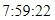

# Atividades de analise de códigos em JavaScript
 

## Código - 1  
 

##  Código - 2
 
 

# Índice ⚜️
 
* [Introdução](#introdução)
 
* [Varíaveis](#Varíaveis)
 
* [Tecnologias-utilizadas](#tecnologias-utilizadas)
 
* [Sites-utilizados](#sites-utilizados)
 
* [Autores](#autores)
 
* [Detalhes](#detalhes)
 
# Introdução 🛠️
O exercício sugerido tinha como objetivo buscarmos os significados de variáveis e compreender suas utilidades. Os códigos exemplificados no arquivo "Codigo-de-exercicio (1).html" estabelecem um temporizador de 10 minutos, enquanto o outro "Codigo-de-exercicio (2).html" apresenta um sistema de verdadeiro e falso para localizar o documento. Abaixo, estarão enumeradas suas variáveis.
 
# Varíaveis ⚔️
 
    - Function: Indica uma função pré determinada.
 
    - var: Representa uma váriavel.
 
    - Date: Cria um campo para que o usuário possa selecionar uma data.
 
    - Document: É o objeto raiz do projeto, representa o própio documento HTML.
   
    - GetElementById: Retorna o elemento cujo atributo Id foi especificado.
 
    - InnerHTML: o HTML interno de alogo, sendo esse último um objeto, ou seja, uma tag.
   
    - if: Significa "se" e é como usamos os operadores lógicos de uma linguagem. Ele condiciona um qualquer, executando-o apenas se ela for verdadeira.
 
    - }: linguagem de criação de scripts ou uma linguagem interpretada.
 
    - return: É usada em uma função para especificar o valor que a função deve fornecer de volta quando é chamada.
   
# Tecnologias-utilizadas 💻
 
    HTML5 e Github
 
# Sites utilizados 📲
 
   * [Terminal root](https://terminalroot.com.br/2016/12/alguns-codigos-simples-de-javascript-2.html)
 
# Autores 📑
 
    - Evellin Monteiro
 
 
# Detalhes
 
    Iniciada: 13/03/2024 Terminada: 15/03/2024.